# RAHASYA: Global Mysteries — AI Production House

An end-to-end, human-governed n8n production system for the US-based YouTube channel [RAHASYA: Global Mysteries](https://www.youtube.com/@RahasyaGlobal). It treats each documentary like a studio production: specialist departments hand work to one another, six accountable human gates control release, and a separate analytics loop feeds measured results into the next editorial cycle.

The suite is advanced automation, not unattended content generation. It is designed to improve throughput and viewer satisfaction without sacrificing factual integrity, rights review, privacy, or YouTube policy compliance. It cannot guarantee channel growth.

## What is included

- **19 deterministic n8n workflows** in [`workflows/`](workflows/)
- **PostgreSQL migration** for projects, events, approvals, rights, costs, analytics, and recommendations
- **Artifact generator** as the source of truth for all workflow JSON
- **Idempotent public-API installer** that resolves credentials and child workflow IDs without embedding secrets
- **Structural/security validator** covering graphs, credentials, release controls, HTTP configuration, telemetry, and SQL
- **Installer integration tests** using a local fake n8n public API
- **US-English editorial strategy** with Eastern Time operations and YouTube growth feedback

## Production architecture

```mermaid
flowchart LR
    A[Authenticated production brief] --> P[Infrastructure and target-channel readiness]
    P --> B[Strategy and executive producer]
    B --> G1{Gate 1: concept}
    G1 --> C[Research and fact check]
    C --> G2{Gate 2: research and facts}
    G2 --> D[Writer and retention editor]
    D --> G3{Gate 3: script}
    G3 --> E[Director, cinematographer, rights, voice and sound]
    E --> G4{Gate 4: production and rights}
    G4 --> F[Render and packaging]
    F --> G5{Gate 5: final cut and packaging}
    G5 --> H[Compliance editor]
    H --> G6{Gate 6: disclosure and privacy}
    G6 --> I[YouTube upload, thumbnail, disclosure, and schedule]
    I --> J[(PostgreSQL)]
    J --> K[Daily analytics and growth loop]
    K --> B
```



### Departments

| No. | Workflow                          | Studio responsibility                                                                |
| --- | --------------------------------- | ------------------------------------------------------------------------------------ |
| 00  | Infrastructure Readiness          | PostgreSQL schema, OmniRoute chat/image catalogs, renderer, OAuth, channel identity  |
| 01  | State & Cost Ledger               | Atomic project snapshots, deduplicated events/costs, rights provenance               |
| 02  | Trends & Growth Strategist        | US discovery context, audience promise, topic portfolio, experiments                 |
| 03  | Executive Producer                | Greenlight thesis, format, scope, schedule, budget/risk controls                     |
| 04  | Investigative Researcher          | Live search, source dossier, counter-evidence, claim classification                  |
| 05  | Fact Checker                      | Claim-to-source matrix, caveats, defamation/privacy risk                             |
| 06  | Documentary Writer                | Original long-form English script with evidence-aware narration                      |
| 07  | Retention Editor                  | Hook, pacing, open loops, payoffs, pattern interrupts, CTA restraint                 |
| 08  | Director                          | Movie-style treatment, beats, emotional arc, edit direction                          |
| 09  | Cinematographer & Visual Evidence | Shot list, factual graphics, B-roll terms, visual constraints                        |
| 10  | Rights & Provenance               | Asset-level license, holder, source, evidence, and clearance status                  |
| 11  | Voice & Sound Director            | Narration, pronunciation, sound design, music restraint                              |
| 12  | MoneyPrinterTurbo Renderer        | Async 16:9 render, polling, output and material-source validation                    |
| 13  | Packaging, SEO & Thumbnail        | Accurate titles, description, tags, chapters, Shorts/community assets, 1280×720 JPEG |
| 14  | Compliance Editor                 | Copyright, privacy, synthetic-media, child-safety, and policy release verdict        |
| 15  | Human Approval Gate               | Authenticated resumable review, reviewer identity, notes, decisions                  |
| 16  | YouTube Publisher                 | Binary upload, schedule, thumbnail, synthetic-media status, final persistence        |
| 20  | Master Production House           | Authenticated intake and ordered A–Z orchestration                                   |
| 30  | Analytics & Growth Loop           | Daily snapshots, 14-day comparison, recommendations and A/B hypotheses               |

Only workflows 20 and 30 have autonomous production triggers. n8n 2.35 requires every workflow referenced by an Execute Sub-workflow node to have a published version, so the installer automatically publishes the master workflow's transitive child dependencies first. Those children expose only Execute Sub-workflow triggers and do not run independently.

## Safety and editorial model

The system deliberately fails closed:

- Search output is treated as **untrusted evidence**, never as instructions.
- Agents must distinguish verified facts, allegations, hypotheses, and folklore.
- Prompts prohibit invented sources, quotes, rights, or certainty.
- Research and fact-check reviews require traceable source mappings and counter-evidence.
- Unresolved or blocked planned assets stop the production-rights gate.
- The renderer requires a MoneyPrinterTurbo `script.json` material manifest with provider, asset ID, and public source page for every selected Pexels clip.
- A blocking compliance verdict stops final release.
- All six human approvals must be present again at publish time.
- Preflight, publishing, and analytics pin OAuth to the configured 24-character RAHASYA channel ID; a credential for any other channel fails closed.
- Privacy, subscriber notification, scheduling, and realistic altered/synthetic-media declarations are accepted only at the final release gate.
- Generated workflows contain credential placeholders, not credential values.

Human approval is not proof that a claim is true or an asset is licensed. Reviewers remain responsible for opening sources, watching the final cut, confirming releases/licenses, and applying current YouTube and applicable US legal requirements.

## Prerequisites

Use a staging channel and staging n8n instance for the first end-to-end run.

1. **n8n 2.35.0** or a schema-compatible release, with:
   - a public base/webhook URL so Wait-form resume URLs remain reachable;
   - execution data retention longer than the longest expected review delay;
   - an API key allowed to read, create, update, and publish workflows;
   - user accounts with execute access for the production intake form.
2. **PostgreSQL** reachable from n8n.
3. **OmniRoute** reachable from n8n and configured with:
   - `/v1/chat/completions`;
   - `/v1/search`;
   - `/v1/images/generations`;
   - an API key represented by an n8n HTTP Bearer Auth credential.
4. **MoneyPrinterTurbo** reachable from n8n, configured for Pexels material search and voice generation. The bundled implementation is expected to expose:
   - `GET /api/v1/tasks` for readiness;
   - `POST /api/v1/videos`;
   - `GET /api/v1/tasks/{task_id}`;
   - `/tasks/{task_id}/script.json` containing `material_sources`.
5. **Google Cloud / YouTube**:
   - YouTube Data API v3 enabled;
   - YouTube Analytics API enabled;
   - OAuth consent and a channel-authorized YouTube credential;
   - the immutable 24-character channel ID beginning with `UC` (not the `@RahasyaGlobal` handle);
   - sufficient upload, thumbnail, update, and analytics quota.
6. Python 3.10+ for generation, validation, installation, and tests. The one-command deployment also requires the PostgreSQL `psql` client unless migration is applied independently.

### Network rule

Service URLs are evaluated **inside n8n**. Do not use `localhost` unless all services share the same network namespace. In Docker, attach the services to one network and use DNS names such as `http://omniroute:20128` and `http://moneyprinter:8080`. Use TLS for traffic crossing a trusted private network boundary. The bundled MoneyPrinterTurbo task and artifact routes do not enforce API authentication, so **never expose them to the public internet**; restrict them to the n8n service network with firewall/network-policy controls.

## Create the four n8n credentials

Create credentials first; copy each credential's ID from n8n and preserve its exact display name.

### 1. OmniRoute HTTP Bearer Auth

Create an **HTTP Bearer Auth** credential containing a scoped OmniRoute API key. Do not place the key in the workflow, installer command history, or `.env.example`.

### 2. Production PostgreSQL

Create a **Postgres** credential with the least privileges required to use the `rahasya_*` tables. A migration role may create the schema; the n8n runtime role only needs normal read/write privileges afterward.

### 3. YouTube OAuth2

Create a **YouTube OAuth2 API** credential. Enable custom scopes and retain n8n's normal YouTube scopes while adding Analytics read access:

```text
https://www.googleapis.com/auth/youtube
https://www.googleapis.com/auth/youtubepartner
https://www.googleapis.com/auth/youtube.force-ssl
https://www.googleapis.com/auth/youtube.upload
https://www.googleapis.com/auth/youtubepartner-channel-audit
https://www.googleapis.com/auth/yt-analytics.readonly
```

If organizational policy requires fewer scopes, test upload, `thumbnails.set`, `videos.update`, and Analytics reports in staging before reducing them. Reauthorize the credential after changing scopes.

Copy the channel's 24-character ID from **YouTube Studio → Settings → Channel → Advanced settings** into `YOUTUBE_CHANNEL_ID`. Do not enter the `@RahasyaGlobal` handle. Workflow 00 checks `channels.list?mine=true` before production, and workflows 16 and 30 repeat the identity check immediately before publishing or analytics.

### 4. Approval-form Basic Auth

Create an **HTTP Basic Auth** credential for authorized reviewers. Use a unique, high-entropy password distributed through the organization's password manager. The resume URL is also sensitive and must not be posted in public chat or logs.

The initial production brief uses n8n user authentication and execute permissions. Wait-form resume endpoints use the separate Basic Auth credential because that is the supported authentication mode for the Wait node.

## Configure locally

```bash
cd automations/rahasya-global
cp .env.example .env
chmod 600 .env
# Edit .env and fill in IDs, names, URLs, and secrets.
set -a
. ./.env
set +a
```

The populated `.env` is ignored by Git. `deploy.py` loads it directly; `install.py` reads the resulting environment values. Neither script creates credentials nor writes credential values into workflow JSON.

## One-command deployment

The deployment orchestrator regenerates artifacts, runs structural validation, validates installer inputs, executes all mocked API tests, applies the transactional PostgreSQL migration, installs/upserts every workflow, verifies the definitions returned by n8n, and optionally publishes triggers dependency-first. It never places the database URL or password in the `psql` argument list.

Preview the complete plan without migration, n8n writes, or publication:

```bash
python scripts/deploy.py --dry-run --activate master,analytics
```

After staging review and authorization, perform the full deployment:

```bash
python scripts/deploy.py --activate master,analytics
```

Publication remains explicit: on a fresh or unpublished suite, omit `--activate` to install and verify without publishing autonomous triggers. Omitting it does not unpublish a trigger that was already published by an earlier deployment. Use `--skip-migration` only when the same migration was applied independently, and `--skip-tests` only in a controlled recovery where the checked artifact was already tested. Every operation is idempotent.

## Migrate PostgreSQL

The deploy command applies this automatically. To apply it independently, back up the target database, then use a migration-capable role:

```bash
psql "$RAHASYA_DATABASE_URL" \
  --set ON_ERROR_STOP=1 \
  --file migrations/001_rahasya_production.sql
```

The migration is additive and uses `CREATE TABLE IF NOT EXISTS`. It creates:

- `rahasya_projects`
- `rahasya_events`
- `rahasya_approvals`
- `rahasya_rights_provenance`
- `rahasya_cost_ledger`
- `rahasya_analytics_snapshots`
- `rahasya_growth_recommendations`

## Generate and validate

Edit [`scripts/generate_workflows.py`](scripts/generate_workflows.py), never the emitted JSON, when changing the suite.

```bash
python scripts/generate_workflows.py
python scripts/validate.py
python scripts/install.py --validate-only
# With the populated .env values exported: validate runtime values without contacting n8n.
python scripts/install.py --validate-config
python -m unittest discover -s tests -v
```

The generator removes stale generated JSON, emits exactly 19 definitions, and rewrites the manifest. The validator checks graph reachability, deterministic node IDs, credential placeholders, secret patterns, n8n HTTP JSON configuration, six release gates, renderer provenance, YouTube controls, telemetry headers, analytics zero-row behavior, and the migration.

## Install through n8n's public API

Preview create/update intent first:

```bash
python scripts/install.py --dry-run
```

Install without publishing trigger workflows:

```bash
python scripts/install.py
```

The installer processes child workflows before parents, resolves child IDs recursively, looks up exact names, creates missing workflows, updates changed workflows, and skips equivalent definitions. It aborts on duplicate exact names or unresolved placeholders. After writes/publications it re-reads all workflows, verifies structural equivalence and current published versions, and fails if n8n reports drift. Re-running it is idempotent.

After inspecting every imported workflow and completing the staging smoke test, request publication of the autonomous trigger workflows:

```bash
python scripts/install.py --activate master,analytics
```

The installer computes a dependency-first publication order. Requesting `master` publishes any current child versions required by n8n before publishing workflow 20; requesting `analytics` publishes workflow 30. Already-current publications are skipped, so this operation is idempotent. Child workflows have no autonomous schedule or public intake trigger.

`--project-id`/`N8N_PROJECT_ID` targets an n8n project. `--insecure` disables TLS verification and is for disposable local development only.

## First staging smoke test

Do not start with a high-risk active investigation.

1. Open the published master workflow's production form path, `rahasya-production-brief`.
2. Submit a benign evergreen topic, a specific US audience, a 4–8 minute target, and at least two known source leads.
3. Confirm workflow 00 passes its PostgreSQL, configured OmniRoute chat/image catalog, MoneyPrinterTurbo, YouTube OAuth, and exact-channel checks. Then confirm a project row and a `project_created` event appear in PostgreSQL.
4. At each gate, query the pending resume URL, open it only over HTTPS, authenticate, inspect the full artifact, and approve or reject:

   ```sql
   SELECT project_id, gate, requested_at, resume_url
   FROM rahasya_approvals
   WHERE decision = 'pending'
   ORDER BY requested_at;
   ```

5. At Gate 4, confirm every planned rights-manifest row is cleared and evidence is real.
6. After render, open the final video and material source pages. Confirm captions, pronunciation, pacing, source graphics, and audio.
7. At Gate 5, inspect the title, description, source links, thumbnail, and final cut together.
8. At Gate 6, choose a staging-safe privacy state. Prefer `private` for the first run, disable subscriber notifications, and truthfully declare synthetic content.
9. In YouTube Studio, confirm the video, thumbnail, audience status, privacy/schedule, and altered-content disclosure before making it public.
10. Manually run workflow 30 and confirm Analytics API access. New/private videos can legitimately return no metric rows.

A rejection intentionally terminates the current master execution after persisting the reviewer decision. Create a revised production or implement an explicit internal revision procedure; do not alter a recorded approval directly in the database.

## Human gates

| Gate                  | Required review                                                                                       |
| --------------------- | ----------------------------------------------------------------------------------------------------- |
| Concept               | Truthful differentiated promise, audience fit, viable scope, measurable growth thesis                 |
| Research & facts      | Source quality, claim mapping, counter-evidence, caveats, privacy and defamation                      |
| Script                | Full revised script, originality, factual fidelity, hook/payoff, non-misleading CTA                   |
| Production & rights   | Director treatment, shots, voice/sound, licenses, releases, provenance                                |
| Final cut & packaging | Watch full render; verify sources, captions, pacing, title, description, tags, thumbnail              |
| Disclosure & privacy  | Compliance verdict, audience status, copyright/privacy, schedule, notifications, synthetic disclosure |

When a gate returns to pending, stale reviewer, notes, release controls, decision timestamp, and final release controls are cleared. Reviewer identity and notes are persisted when a new decision is submitted.

## YouTube release semantics

- Before media download or upload, the publisher verifies that OAuth resolves to exactly `YOUTUBE_CHANNEL_ID`; a mismatch stops the execution.
- **Immediate release:** choose `public`, `unlisted`, or `private` and leave **Publish At** blank.
- **Scheduled release:** enter a valid ISO 8601 timestamp at least five minutes in the future and choose `private`. YouTube requires scheduled uploads to begin private.
- The same `publishAt` value is included in both the native upload and the direct `videos.update`, preserving the schedule while setting `status.containsSyntheticMedia`.
- The reviewer must answer whether the video contains realistic altered or synthetic material. The workflow sends that Boolean explicitly; it does not infer the declaration from whether AI tools were used.
- Thumbnail upload uses `thumbnails.set` with the approved binary. Packaging normalizes it to 1280×720 JPEG and blocks files over 2 MB.
- Subscriber notification is controlled only by the final reviewer.

A failure after YouTube accepts the video can leave a private upload even though final PostgreSQL persistence has not run. In that case, inspect YouTube Studio and the retained n8n execution. Retry the failed node in that execution where safe; **do not restart the entire master workflow**, which could create another upload.

## Growth system

The system targets durable growth signals rather than volume spam:

- US search/discovery context and timely angles
- clear viewer promise and honest curiosity gaps
- first-30-second hook, open-loop/payoff map, pacing and pattern interrupts
- accurate title/thumbnail pairing instead of misleading clickbait
- chapters, pinned comment, community post, and Shorts hooks
- recurring formats and return-viewer strategy
- daily YouTube Analytics snapshots at 08:15 America/New_York
- recent 14 days versus prior 14 days
- video diagnostics, next-topic recommendations, and controlled packaging/format experiments
- long-term viewer satisfaction as the optimization objective

Analytics recommendations are hypotheses, not causal findings. A human producer should choose experiments, change one major variable at a time, define a primary metric and guardrail, and record the result.

## Operations

### Useful status queries

```sql
-- Current productions
SELECT project_id, topic, status, current_stage, updated_at
FROM rahasya_projects
ORDER BY updated_at DESC;

-- Approval audit
SELECT project_id, gate, decision, reviewer, requested_at, decided_at
FROM rahasya_approvals
ORDER BY requested_at DESC;

-- Rights requiring attention
SELECT project_id, asset_key, source_url, clearance_status, notes
FROM rahasya_rights_provenance
WHERE clearance_status IN ('unresolved', 'blocked')
ORDER BY updated_at DESC;

-- Recorded automation cost
SELECT stage, provider, model, count(*) AS requests, sum(cost_usd) AS cost_usd
FROM rahasya_cost_ledger
GROUP BY stage, provider, model
ORDER BY cost_usd DESC NULLS LAST;

-- Latest growth output
SELECT period_start, period_end, recommendations, experiment_plan
FROM rahasya_growth_recommendations
ORDER BY created_at DESC
LIMIT 1;
```

### Expected render states

MoneyPrinterTurbo state `4` means processing, `1` complete, and `-1` failed. The workflow polls every 30 seconds. Unknown states, missing video output, missing provenance, or incomplete material records stop production.

### Monitoring

Alert on:

- infrastructure-readiness or target-channel identity failures;
- failed or long-running master executions;
- approvals pending beyond the editorial SLA;
- render jobs with no progress;
- compliance `block` verdicts;
- YouTube quota/OAuth errors;
- analytics not completing for more than two days;
- unusual cost growth by stage/provider/model.

OmniRoute request IDs, provider/model decisions, token usage, response cost, latency, cache state, and `X-OmniRoute-Fallback-Attempts` are stored in `rahasya_cost_ledger` when provided.

### Backup and recovery

- Back up PostgreSQL and n8n before migration or suite updates.
- Retain waiting execution data until all approvals are complete.
- Keep generated media and MoneyPrinterTurbo task manifests according to the editorial retention policy.
- Treat approval resume URLs and unpublished video URLs as sensitive.
- Restore databases and n8n from a consistent point in time; project JSON and approval executions must agree.

## Updating or replacing a department

1. Modify the relevant prompt, JavaScript, SQL, or node definition in `scripts/generate_workflows.py`.
2. Preserve the child contract: one item containing `json.project`, plus approved binary data where applicable.
3. Regenerate and run all validations/tests.
4. Use installer dry-run against staging.
5. Import/update, inspect the diff in n8n, and run a complete staged production.
6. Request the new master/analytics publication only after review; the installer republishes any changed child dependencies first.

The renderer is replaceable if a new child keeps the same contract: it receives an approved project and returns `project.render.video_url`, task metadata, completion state, and verifiable asset provenance.

## Known external constraints

- YouTube quotas, OAuth review, channel permissions, scheduling eligibility, API behavior, and policy can change.
- Search results and model outputs can be incomplete or wrong.
- Automated rights metadata does not replace a license, release, or legal review.
- Pexels source pages must remain traceable; provider terms still require human verification for the intended use.
- MoneyPrinterTurbo and configured providers determine rendering speed, voice quality, and media availability.
- The public channel did not provide an API-backed brand/performance baseline to this suite. Producers should add current audience research, channel voice, content inventory, and baseline KPIs before optimizing cadence.

## File map

```text
automations/rahasya-global/
├── .env.example
├── README.md
├── manifest.json
├── migrations/001_rahasya_production.sql
├── scripts/deploy.py
├── scripts/generate_workflows.py
├── scripts/install.py
├── scripts/validate.py
├── tests/test_deploy.py
├── tests/test_installer.py
└── workflows/*.json
```

## References

- [n8n API authentication](https://docs.n8n.io/api/authentication/)
- [n8n workflow API](https://docs.n8n.io/api/api-reference/)
- [YouTube `videos.insert`](https://developers.google.com/youtube/v3/docs/videos/insert)
- [YouTube `videos.update`](https://developers.google.com/youtube/v3/docs/videos/update)
- [YouTube `thumbnails.set`](https://developers.google.com/youtube/v3/docs/thumbnails/set)
- [YouTube Analytics reports](https://developers.google.com/youtube/analytics/reference/reports/query)
- [YouTube altered or synthetic content disclosure](https://support.google.com/youtube/answer/14328491)
